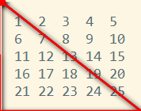

[TOC]

# 数组Array

## 什么叫数组
一系列数据的集合，每一项可以保存任何类型的数据，称为数组的元素，每个元素之间用逗号隔开
> 数组格式：[数组元素,数组元素,数组元素]

## 数组定义方式
```javascript
//1)字面量(推荐)
var arr = [1,2,3];

//2)使用构造函数创建
var arr = new Array();//创建一个空数组
var arr = new Array('laoxie','lemon' ,'tiantian','yy');//创建数组并同时写入数据
```

## 数组操作

### 数组读取与写入
* 索引（下标）：从0开始
``` javascript
    var arr = ['html5','css3','javascript'];

    //读取
    arr[0]; //=> 'html5'
    arr[2]; //=> 'javascript'

    //写入
    arr[3] = 'web前端';
```


* length：表示数组的长度
```js
    arr.length; //=> 3
```

### 数组遍历
* for循环
```javascript
    var arr = ['html5','css3','javascript'];
    for(var i=0;i<arr.length;i++){
        console.log(arr[i]);
    }
```


### 常用数组方法
* 添加
    * `push()`： 往数组尾部添加一个或多个元素，返回数组新的长度
    * `unshift()`：往数组开头添加一个或多个元素，返回数组新的长度
* 删除
    * `pop()`：删除数组最后一个元素，返回删除的元素
    * `shift()`：删除数组第一个元素，返回删除的元素
* 添加/删除/替换:  `splice(start,deleteNum,...items)`
    - start：起始索引位置
    - deleteNum：要删除的数量
    - items：插入的元素（可以是多个）
* 截取：`slice(start[,end])`
    > 返回数组的片段或子数组，从start开始到end(不包括end所对应的元素)，如果省略end参数，则截取到数组的最后一项,支持负数
* 转字符串：`join(separator)`: 将所有数组元素用分隔符连接成一个字符串
    - separator：为分隔符，默认为逗号

## 数组排序
* 冒泡排序法
    > 当前元素跟下一个元素对比, 把大的逐个往后排列
* 选择排序法
    > 把当前元素分别跟后面的元素对比, 把小的逐个往前排列
* 快速排序法
    > 利用递归实现, `concat()` 数据拼接(参数可以是多个)，返回一个新数组
* `sort()`方法排序
    * `sort(fn)`：将数组中的元素排序，并返回排序后的数组
        * 默认:以**字符编码**的顺序排列（如数组元素非字符串会自动转成字符串）
        * 比较函数`fn(a,b)`：利用fn的**返回值**来确定数组中a和b的位置
            - 返回负数：升序，[a,b...]
            - 返回0：不改变原有位置
            - 返回正数：降序，[b,a...]
    * `reverse()`：将数组中的元素颠倒顺序，返回逆序后的数组


```javascript
    //分别用冒泡/选择排序法排列以下数据
    var price = [29,9,299,19,198,998,598,69]
```


## 值类型与引用类型的区别
> 内存中的状态

### 数组复制与传输
* 如何复制数组
* 把数组作为函数的参数


### 多维数组(数组里面包含数组)（了解）
```javascript
    var arr = [1,2,'html5',[3,4,'css3'],[5,6,'javascript']]
    arr[3][2]; //=>'css3'
```

---

**【案例】**

* 创建一个包含50个三位数的随机数组
* 随机点名程序（简单版）
* 找出以下数组中所有小于10的元素并组成一个新的数组
    > [10,15,2,32,5,4,20,8,48,54,6]
* 封装一个map(arr)函数，把数组中的每一个数字都增加20%，并返回新的数组

**【练习】**

1. 编写一个`has()`函数，判断数组中是否包含某个数
    > 如：has(arr,60)，判断arr中是否包含60这个数
2. 有一个从小到大排序的数组`[3,5,6,20,22,33,88]`。现输入一个数，要求按原来的规律将它插入数组中，并打印出新的数组
3. 定义一个含有30个整数的数组，按顺序分别赋予从2开始的偶数；然后按顺序每五个数求出一个平均值，放在另一个数组中并输出。试编程。
    > var arr = [2,4,6,8,10,...,60]; 

---

# 对象Object
> 对像也叫关联数组，格式：{属性:属性值,属性:属性值}

## 对象创建方式
* 字面量（推荐）
* 构造函数
```js
    var obj = {name:'小明',age:18}

    var obj = new Object(); //等效于: var obj = {}
```

## 属性值操作
* 方括号方式：`对象['属性名']`
* 点语法：`对象.属性名`

```javascript
    var obj = {name:'小明',age:18}

    // 1、读取属性
    obj['name'];//==>小明
    obj.name;//==>小明

    //如果读取一个不存在的属性，返回undefined
    obj.nickname;//undefined

    // 2、修改属性
    obj.age = 28;

    // 3、添加属性
    obj.sex = '男';
    obj['marry'] = false;

    // 4、删除属性
    delete obj.age;//删除age属性
```

## 遍历对象for...in
```javascript
    var obj = {
        name:'laoxie',
        age:18
        gender:'男'
    }

    //遍历对象
    for(var attr in obj){
        //遍历过程中每次把对象属性值赋值给attr变量
        //所以获取对象属性值为：obj[attr]
        console.log(obj[attr]);//分别输出：'laoxie',18,'男'
    }
```

## 数组与对象的组合
```javascript
    var goodslist = [{
        id:'001',
        name:'iphone7 plugs',
        imgurl:'img/ip7.jpg',
        price:5899.00,
        sale:5888.00,
        color:'土豪金'
    },{
        id:'002',
        name:'Note7',
        imgurl:'img/note7.jpg',
        price:3899.00,
        sale:998.00,
        color:'黑色'
    },{
        id:'003',
        name:'荣耀7',
        imgurl:'img/honor7.jpg',
        price:1999.00,
        sale:1899.00,
        color:'白色'
    }]
```


# ECMAScript5(ES5)Array新增方法

### 静态方法
* Array.isArray()
判断是否为数组，返回true/false

### 索引方法
* indexOf/lastIndexOf(keyword [,startIndex])
    > 方法返回keyword在数组中的索引值，如果数组不存在keyword，则返回-1，indexOf/lastIndexOf的区别就是一个从前往后找，一个从后往前找
    - keyword: 要查找的项，
    - startIndex：查找起点位置的索引，该参数可选，默认0

### 迭代（遍历）方法
* forEach(fn)
    > 遍历方法，for循环没有太大差别，比for循环方便
* map(fn)
    > 返回一个数量相等的数组，内容是什么取决于在fn中返回的值
* filter(fn)
    > 得到执行fn后返回true时对应的数组元素，利用这个方法可对数组元素进行过滤筛选
* some(fn)
    > 如果该函数中任何一项返回 true，则返回true
* every(fn)
    > 如果该函数对每一项都返回 true，则返回true

>参数fn为一个函数，函数中有三个形参分别为：
- item：数组中的每一项
- index：遍历过程中对应的索引值
- array：对数组的引用


### 归并方法（了解）
>这两个方法都会迭代数组中的所有项，然后生成一个最终返回值。

* reduce(fn,initVal)
* reduceRight(fn,initVal)
    - fn(prev,cur,index,array): fn是每一项调用的函数，函数接受4个参数分别是
        + prev：前一次遍历的返回值，第一次遍历时为`initVal`
        + cur：当前值，
        + index：索引值，
        + array：当前数组，
        > 注意：该函数需要返回一个值，这个值会在下一次迭代中作为prev的值
    - initVal: 迭代初始值（可选），如果缺省，函数中prev的值为数组第一项

---

**【案例】**

1. 分别计算出以上数组的最大值，最小值和平均值，并输出他们的索引
>[10,2,8,55,32,18,9,11,30,16,19,20]
2. 显示最新输入的新闻信息

3. 根据数据生成一个商品列表

**【练习】**

1. 随机生成一个五位以内的数，然后输出该数共有多少位，每位分别是什么
2. 创建一个对象，用于存储一个学生的信息，该对象包含名字、学号、身份证、年龄、性别、所学专业等属性信息，同时该对象包含一个自我介绍的方法，用来输出该对象的所有信息
3. 通过循环按顺序为一个5×5的二维数组arr赋1到25的自然数，然后输出该数组的左下半三角的和。试编程。


**【作业】**

1. 编写一个norepeat(arr)去重函数，去掉数组中的重复项，并返回一个新的数组
2. 以下是某班级一次考试的成绩表。请计算每个学生总成绩，并按总成绩排名。统计各单科成绩第一名，输出其成绩与学号。

|学号|语文|数学|英语|总成绩|备注|
|:--:|----|----|----|------|----|
|1   |105   |62  |118     
|2   |89    |78  |120     
|3   |86    |64  |80      
|4   |78    |99  |91      
|5   |107.5 |97  |70      
|6   |112   |61  |92      
|7   |101   |79  |104     
|8   |71    |72  |105     
|9   |56    |68  |61      
|10  |98    |83  |77   

**【扩展】**

* 用数组实现斐波那契数列   
* 商品列表实现价格、销量排序

---
## 下节预习
* 字符串String
