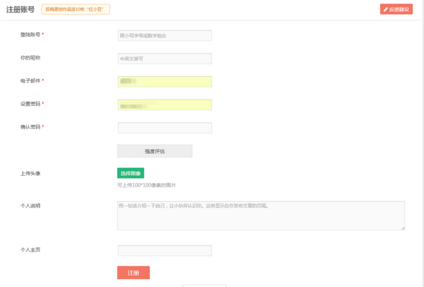

[TOC]

# 正则表达式


## 了解正则表达式
* 什么是正则表达式
正则表达式(regular expression)是一个描述字符模式的对象。

* 为什么要使用正则表达式
正则表达式能够进行强大的“**模式匹配**”和“**文本检索与替换**”功能。前端往往有大量的表单数据校验的工作，采用正则表达式会使得数据校验的工作量大大减轻

## 创建正则表达式

* 构造函数
    ```js
        var reg= new RegExp('study');

        //使用特殊字符
        var reg= new RegExp('\\d\\w+');
    ```


* 字面量方式
    >字面量是字符匹配，不支持变量
    ```js
        var reg = /study/;
    ```
* 参数
    - i: case-insensitive，表示忽略大小写
    - g: global，表示全局匹配
    - m: multiline，表示多行匹配,影响^，$的匹配结果

    ```js
        var reg = new RegExp('study', 'ig');
        var reg = /study/gi;
    ```


## 使用正则表达式

### 支持正则表达式的字符串方法
* `search(reg)`
    返回第一次匹配时所在的索引值,如果匹配不到则返回-1
* `match(reg)`
    - 默认匹配字符串，返回一个数组
        + 0:所匹配的字符
        + index:匹配第一个字符所在的索引
        + input:对字符串的引用
    - 全局匹配(添加参数g)，返回一个匹配所有字符串数组(无index和input属性)
    - 如果匹配不到则返回null
* `replace(reg,placement)`
    替换字符串
* `split(reg)`
    ```js
        'a,b ,c , d, e'.split(/\s*,\s*/);
    ```


### 正则表达式的属性和方法
* 测试正则表达式用test方法,返回布尔值
    - 格式：`reg.test(str)`
    - 用正则表达式`<reg>`测试<字符串str>是否匹配规则,返回true/false
* 测试正则表达式exec方法
    ```js
        /xx/.exec(字符串)
    ```


### 匹配规则
* 原字匹配：所有字母和数字都是按照字面量进行匹配,和字符串匹配等效
`/good/gi`

* 字符类
    > 以下所有字符类都只是匹配“**一个**”字符
    - `. ` : 除换行以外的字符
    - `\w` : 代表数字或字母或下划线
    - `\W` : 非数字字母和下划线字符
    - `\d` : 数字
    - `\D` : 非数字
    - `\s` : 代表一个空格
    - `\S` : 空格以外的字符
* 边界处理
    - `\b` : 匹配一个单词边界，也就是指单词和空格间的位置
    - `\B` : 匹配非单词边界。

* 特殊符号
    > ^  $  .  *  +  ?  =  !  :  |  \  /  ()  []  {}
    
    - `[]`: 代表任意“单个字符” ,里面的内容表示“或”的关系
        + -: 代表范围
        + ^: 代表非

    - `()`: 表示分组（n是以最左边括号出现的顺序排列）
        + $1: 表示第一个分组
        + $n: 表示第n个分组（不能写在正则表达式里）
        + \n: 在正则分组后面使用，表示对第n个分组的引用(一定要写在正则表达式里)
        > PS: 编写的正则分组数量越少越好

    - `|`:  表示或者

    - 锚点定位
        + `^`: 表示以什么开头
        + `$`: 表示以什么结尾

    - 表示数量，对前一个字符计数，
        + `*`: 代表0个或0个以上 <===>{0,}
        + `+`: 代表1个或1个以上 <===>{1,}
        + `?`: 代表0个或1个     <===>{0,1}
        + `{}`:
        ```js
            \d{5} //匹配5个数字
            \d{5,10} //匹配5个到10个数字
            \d{5,} //匹配5个或5个以上的数字
        ```

    * 贪婪模式与非贪婪:
        * 1）数量词`*,+,{5,}`，会尽可能多的去匹配结果（贪婪）
        * 2）在**数量词后**面加一个`?`表示尽可能少的去匹配结果（非贪婪）
            > google,goooogle ==> /go+/


---

**【案例】**

* 快速替换html标签
* 去除首尾空格
* 提取手机号码
* 表单验证
    * 验证账号
        - 不能为空，
        - 不能使用特殊字符（只能使用数字、字母、下划线、横杠），
        - 必须以字母开头，
        - 长度6-20 
    * 昵称只能输入中文
        >Unicode编码中的汉字范围 /^[\u2E80-\u9FFF]+$/
    * 电子邮件
    ```
        jinrong.xie@qq.com
        x@qq.com
        x@163.com
        x@a-r.com.cn
    ```
    * 密码  
        - 长度小于20 
        - 不能包含空格
    * 身份证
        > 18/15位
    ```
        445655 19900707 2165
        445655 19900707 211x
        ```
        * 手机号码
        * 生日 
        ```
        1999/05/08
        1999-5-8
        19990508
    ```

**【练习】**

* 邮政编码检测
* 文件格式检测
* 邮箱格式检测


**【作业】**



1. 表单验证
    * 登录名
        - 必填
        - 数字或字母组合
        - 不能少于3位
    * 昵称
        - 中英文皆可
    * 电子邮件
        - 必填
    * 密码
        - 必填
        - 至少6位
        - 显示密码强度
            + 弱：只有数字
            + 一般：数字字母组合
            + 强：数字字母特殊字符组合

---

## 下节预习

* ES5+ES6
